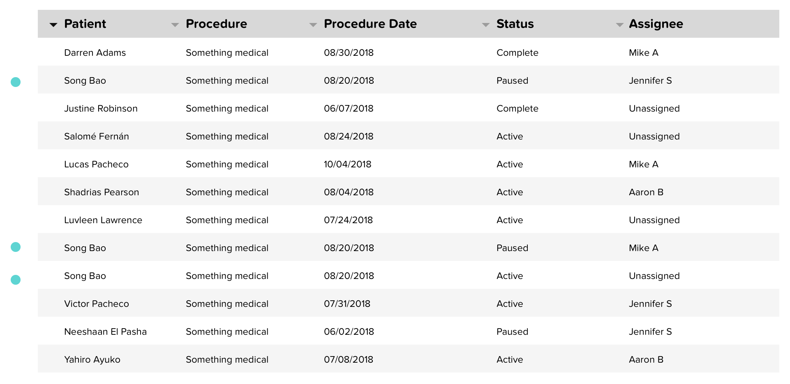
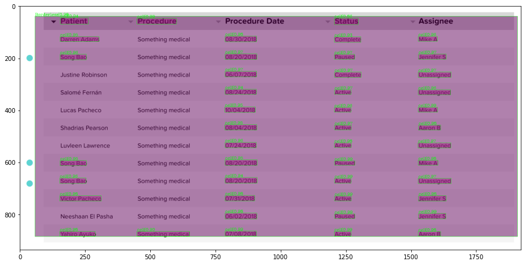

# Tabular Image to CSV:-

## Prerequisites :-

* [OpenCV]()
* [pytesseract]()
* [PIL]()
* [Pandas]()
* [Imutils]()


### Installing Requirements:

Install requirements from requirements.txt
```
pip install -r requirements.txt
```

To install 'pytesseract'
'''
apt install tesseract-ocr
apt install libtesseract-dev
pip install pytesseract
'''

##Project Structure:-

* [images]() :- This folder contains images to be used for OCR.
* [output_csv]() :- It contains result of tabular image in csv file.
* [detections]() :- Images with table detections (i.e. image with bounding boxes and their co-ordinates saved as.npy files) using CascadeTabNet.
* [requirements.txt]() :- Requirement file.
* [roi-to-csv.py]() :- Code file.


## Python command  to run script

To get ROIs and image with detections  add **detection.py** code to [CascadeTabNet Demo](https://github.com/DevashishPrasad/CascadeTabNet/blob/master/Demo/Cascade_TabNet_Demo.ipynb) notebook.

Running this updated notebook gives .npy files with ROIs like in **detections** folder.

```
python3 roi-to-csv.py --img-path <path-to-desired-image> --roi-path <path-to-folder-containing-npy-files>
```

### Original:-



### ROI:-




    
